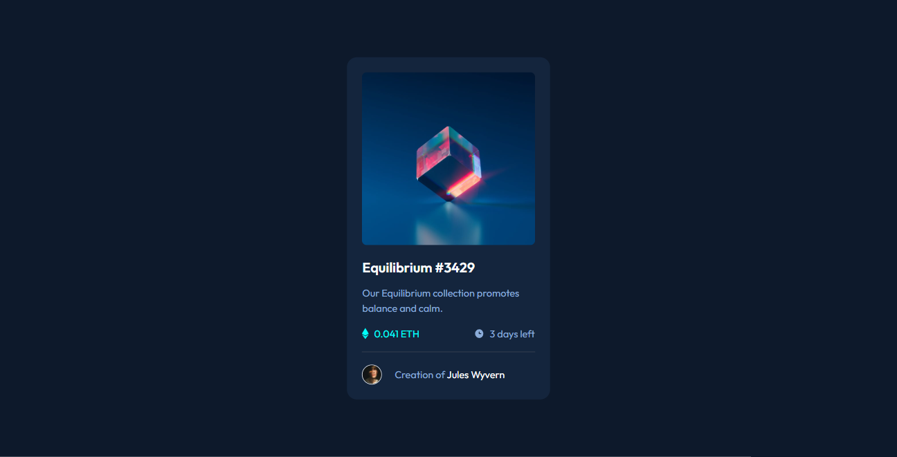
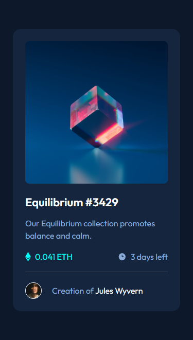

# Frontend Mentor - NFT preview card component solution

This is a solution to the [NFT preview card component challenge on Frontend Mentor](https://www.frontendmentor.io/challenges/nft-preview-card-component-SbdUL_w0U). Frontend Mentor challenges help you improve your coding skills by building realistic projects. 

## Table of contents

- [Overview](#overview)
  - [The challenge](#the-challenge)
  - [Screenshot](#screenshot)
  - [Links](#links)
- [My process](#my-process)
  - [Built with](#built-with)
  - [What I learned](#what-i-learned)
  - [Continued development](#continued-development)
  - [Useful resources](#useful-resources)
- [Author](#author)
- [Acknowledgments](#acknowledgments)


## Overview

### The challenge

The challenge is to make the solution as posible to as design. We can use whatever framework that we want. such as i used tailwind for this challenge.

### Screenshot

**Destkop**



**Mobile**



### Links

- Solution URL: [Add solution URL here](https://your-solution-url.com)
- Live Site URL: [Add live site URL here](https://your-live-site-url.com)

## My process

### Built with

- Semantic HTML5 markup
- CSS custom properties
- Flexbox
- Mobile-first workflow
- [Tailwind](https://tailwindcss.com/) - CSS Framework


### What I learned

In this challenge i learned that how to define the color and thikness of hr line. I did it using tailwind css so due to that i also improve my skills around group and peers in tailwind.


```html
<hr class="h-px border-0 bg-gray-700">

```


### Continued development

i and not continue any futher development in this project due to its limitation. but yes when i will learn js i will add functionality of js in another css projects for that updates you can follow me on github.


### Useful resources

- [resource 1](https://flowbite.com/docs/typography/hr/) - This help me in how to define the thikness and background color of hr tag in tailwind


## Author

- Website - [Dheerendra Kumar]()
- Frontend Mentor - [https://github.com/acekant](https://www.frontendmentor.io/profile/acekant)

## Acknowledgments

Web dev simplified - Youtube channel
